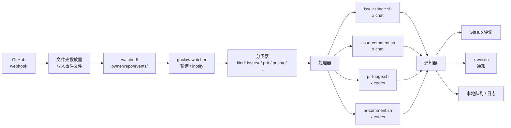

# ghclaw — GitHub 事件的 claw 设计

**ghclaw** 是一种 *claw 设计*——用于 **GitHub 事件** 的基于文件夹
的事件监听器模式。GitHub 事件作为文件进入被监听的文件夹；`ghclaw`
拾取它们，分类事件类型，并将每个事件路由到 AI 辅助的处理器。回复
与通知通过标准 x-cmd 通知通道发回。

> **TL;DR。** `ghclaw` 监听一个文件夹中的 GitHub 事件文件。每个
> 事件被一个 *claw* **抓取**，由它分类（`issue#comment`、`issue#created`、
> `pr#opened` 等）并路由到正确的处理器 —— 通常是通过 `x chat`、
> `x pi` 或 `x codex` 调用的 AI 模型。处理器回复、分类或升级；
> 结果通过配置的通知通道回到 GitHub issue 或 PR。

## 什么是 "claw 设计"？

"claw"（爪）的隐喻：每个事件被一个 *claw* **抓取**，由它
分类，并决定丢弃、回复或升级。claw 设计有四个部分：

1. **Watcher**（监听器）—— 轮询或订阅文件夹 / 流。
2. **Classifier**（分类器）—— 把原始事件转为类型化信封
   （`issue#created`、`pr#comment` 等）。
3. **Handlers**（处理器）—— 每个事件类型一个。处理器可以是
   纯 shell、通过 `x chat` 调用的 AI 模型，或一段脚本。
4. **Notifier**（通知器）—— 把处理器的响应发回上游
   （GitHub 评论、GitHub PR 回复、`x weixin` 消息等）。

`ghclaw` 是这个设计在 GitHub 事件上的具体实例。

## ghclaw 为什么存在？

GitHub 产生事件洪流：`issues`、`pull_request`、`issue_comment`、
`push`、`release`、`workflow_run` 等几十种。标准反应是给每个事件
粘一个云函数（Lambda / Cloud Functions / Cloudflare Workers），
为每个用例写一个小机器人。

claw 设计压缩了这个过程：

- **一个文件夹，一个 watcher。** 每个事件落地为一个文件。
- **一个分类器，多个处理器。** 分类器解析 GitHub 的 webhook
  信封；处理器小而可组合。
- **一个通知器，多个通道。** 回复可以回到 GitHub、到 WeChat
  （`x weixin`）、到本地队列、或到日志文件。
- **AI 处理器通过 `x chat` / `x pi` / `x codex`。** 一个处理器
  可以是一行命令，把事件管道到 `x chat` 并把模型响应写回
  GitHub 评论。

这个模式把事件循环样板代码换成 **可推测的文件流** —— 更易调试、
更易回放、更易手工测试。

## 工作原理

### 文件夹布局

```
watched/
├── <owner>/
│   ├── <repo>/
│   │   ├── events/
│   │   │   ├── 2026-09-22T03:14:07Z-issue#1234-created.txt
│   │   │   ├── 2026-09-22T03:18:42Z-issue#1234-comment-4567.txt
│   │   │   └── 2026-09-22T04:01:11Z-pr#5678-opened.txt
│   │   └── replies/
│   │       └── 2026-09-22T03:18:50Z-issue#1234-reply.txt
│   └── <other-repo>/...
└── <other-owner>/...
```

`ghclaw` 监听 `watched/`（可配置）。新事件文件出现时，分类器解析
文件名（`<ts>-<kind>-<id>.txt`）与内部信封，再路由到匹配的处理器。

### 监听循环

```sh
# 伪代码 — 真实实现见 x-bash/ghclaw
ghclaw run ./watched/ \
  --on "issue#created"  ./handlers/issue-triage.sh \
  --on "issue#comment"  ./handlers/issue-comment.sh \
  --on "pr#opened"      ./handlers/pr-triage.sh \
  --on "pr#comment"     ./handlers/pr-comment.sh
```

每个处理器是一个小脚本。处理器可以是：

- **纯 shell** —— 按 label、tag、作者等分类。
- **AI 通过 `x chat`** —— 把事件文本管道给模型并用响应作为回复。
- **AI 通过 `x pi` / `x codex`** —— 代码感知分类
  （`x codex` 用于 PR 评审风格评论；`x pi` 用于 issue 分类）。

### 处理器示例：AI 辅助 issue 分类

```sh
# handlers/issue-triage.sh
# 从 stdin 读取事件文件；把分类回复写到 stdout。
set -eu

event="$1"

# 为模型汇总 issue
summary=$(jq -r '.issue.title + "\n\n" + .issue.body' < "$event")

# 让模型分类并起草分类回复
x chat --model claude-sonnet \
  --system "You are a GitHub issue triage assistant. Be terse." \
  --input "$summary"
```

输出被捕获，作为 GitHub 评论发回。

### 处理器示例：代码感知 PR 评审

```sh
# handlers/pr-comment.sh
set -eu

event="$1"

# 提取 diff hunks + 线程上下文
diff=$(jq -r '.comment.body' < "$event")
context=$(jq -r '.pull_request.body' < "$event")

x codex --input "$context" --followup "$diff"
```

`x codex` 是代码感知的兄弟模块；它产生的响应比 `x chat` 更聚焦
于评审风格。

## 架构



## 事件分类

`ghclaw` 识别一小套 GitHub 事件。分类器解析文件名与信封。

| 类型 | 触发 | 典型处理器 |
| --- | --- | --- |
| `issue#created` | 新 issue 打开 | 分类：标记、打标签、起草回复 |
| `issue#comment` | 现有 issue 评论 | 若 @ 提及则回复；否则分类 |
| `issue#closed` | issue 关闭 | 记录；首次贡献者感谢 |
| `pr#opened` | 新 PR 打开 | 代码评审；CI 状态检查 |
| `pr#comment` | PR 评论 | 若 @ 提及则回复；高优先级则评审 |
| `pr#review` | PR 评审提交 | 处理评审评论 |
| `pr#merged` | PR 合并 | 记录；首次贡献者感谢 |
| `push` | 推送到被监听分支 | CI 状态；部署钩子 |
| `release` | 新 release 发布 | 通知；在下游系统中打 tag |
| `workflow_run` | CI workflow 完成 | 记录；失败告警 |
| `star` / `fork` | 仓库 star / fork | 记录；汇总 |

通过 `--on` 处理器支持自定义类型。

## 如何使用

### 1. 设置 webhook 转发器

把 GitHub webhook 转发到被监听的文件夹。最简单的转发器是一个
Cloudflare Worker / Lambda / Functions，接收 webhook POST 后
写入事件文件：

```js
// Cloudflare Worker — 转发器示例
export default {
  async fetch(req, env) {
    if (req.method !== "POST") return new Response("OK", { status: 200 });
    const payload = await req.text();
    const event = req.headers.get("X-GitHub-Event");
    const delivery = req.headers.get("X-GitHub-Delivery");
    const ts = new Date().toISOString();
    const path = `watched/${owner}/${repo}/events/${ts}-${event}-${delivery}.txt`;
    await env.BUCKET.put(path, payload);
    return new Response("OK", { status: 200 });
  },
};
```

### 2. 在被监听文件夹上启动 `ghclaw`

```sh
ghclaw run ./watched/ \
  --on "issue#created"  ./handlers/issue-triage.sh \
  --on "issue#comment"  ./handlers/issue-comment.sh \
  --on "pr#opened"      ./handlers/pr-triage.sh \
  --on "pr#comment"     ./handlers/pr-comment.sh
```

`ghclaw` 是一个长跑进程；用你常用的服务管理器（systemd、tmux、
supervisord、容器等）跑它。

### 3. 分类 / 回复 / 升级

每个事件触发匹配的处理器。处理器写入回复文件；通知器把它作为
GitHub 评论发回。

## 自定义处理器

处理器是纯 shell 脚本。从 `$1`（或 stdin）读取事件，把回复写到
stdout（或写到 `watched/<owner>/<repo>/replies/` 下的回复文件）。

```sh
# handlers/my-custom-handler.sh
set -eu
event="$1"
# … 你的逻辑 …
echo "$output" > "watched/$(jq -r '.repository.full_name' < "$event")/replies/$(date -u +%FT%TZ)-reply.txt"
```

接入：

```sh
ghclaw run ./watched/ \
  --on "issue#created"  ./handlers/my-custom-handler.sh
```

## 通知通道

通知器支持多个通道：

- **GitHub 评论** —— 通过 GitHub API 作为 issue / PR 评论回复。
- **`x weixin`** —— 通过 `x weixin` 模块转发到微信（用于个人通知）。
- **本地队列 / 日志** —— 把回复写入文件或管道到本地 Unix 套接字
  供下游消费。
- **Webhook** —— 把回复 POST 到配置的 URL。

每个事件类型可以组合多个通道。

## 何时用 vs 何时不用

**用 ghclaw 的场景：**

- 你想要 AI 辅助的 GitHub 分类，不用写服务器。
- 你想要一个监听器处理每种事件类型。
- 你想通过检视文件来调试事件流（events 文件夹是真相之源）。
- 你想接入自定义处理器而不用重建监听器。

**不用 ghclaw 的场景：**

- 你需要亚秒级实时延迟。`ghclaw` 基于文件夹；延迟取决于轮询
  间隔或 inotify 延迟。
- 你部署在只有无服务器、没文件系统的平台上。该模式假定持久
  文件夹。
- 你想要带 UI 的托管方案。`ghclaw` 是一个模式 + 一个 CLI；
  不附带 UI。

## 下一步？

- **在一个仓库上试试。** 从一个仓库转发 webhook；先只用
  `issue#created`。
- **加 AI 处理器。** 把事件管道进 `x chat`，让模型起草回复。
- **自定义分类规则。** 按 label、按作者、按文件路径前缀加
  处理器。
- **通知团队。** 对高优先级事件同时启用 GitHub 评论 + `x weixin`。

## 源码与资源

- **源码：** <https://github.com/x-bash/ghclaw>
- **模块：** <https://github.com/x-cmd/x-cmd>（mod/ghclaw/）
- **Webhook 事件：**
  <https://docs.github.com/en/webhooks/webhook-events-and-payloads>
- **x chat：** <https://x-cmd.com/mod/chat>
- **x codex：** <https://x-cmd.com/mod/codex>
- **x pi：** <https://x-cmd.com/mod/pi>
- **x weixin：** <https://x-cmd.com/mod/weixin>