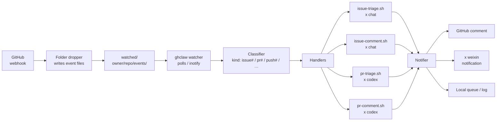

# ghclaw — A Claw Design for GitHub Events

**ghclaw** is a *claw design* — a folder-based event listener
pattern for **GitHub events**. GitHub events arrive as files in
a watched folder; `ghclaw` picks them up, classifies the event
type, and routes each event to AI-assisted handlers. Replies
and notifications are sent back via the standard x-cmd
notification channels.

> **TL;DR.** `ghclaw` watches a folder for GitHub event files.
> Each event is grabbed by a *claw* that classifies it
> (`issue#comment`, `issue#created`, `pr#opened`, …) and
> routes it to the right handler — often an AI model via
> `x chat`, `x pi`, or `x codex`. The handler replies, triages,
> or escalates; the result lands back in the GitHub issue or
> PR via the configured notification channel.

## What is a "claw design"?

The "claw" metaphor: each event is **grabbed** by a *claw*
that sorts it, classifies it, and either drops it, replies
to it, or escalates it. A claw design has four pieces:

1. **Watcher** — polls or subscribes to a folder / stream.
2. **Classifier** — turns raw events into typed envelopes
   (`issue#created`, `pr#comment`, …).
3. **Handlers** — one per event type. Handlers can be plain
   shell, an AI model via `x chat`, or a script.
4. **Notifier** — sends the handler's response back to the
   upstream (GitHub comment, GitHub PR reply, `x weixin`
   message, etc.).

`ghclaw` is a concrete instance of this design for GitHub
events.

## Why does ghclaw exist?

GitHub produces a firehose of events: `issues`, `pull_request`,
`issue_comment`, `push`, `release`, `workflow_run`, and dozens
more. The standard reaction is to glue a Cloud Function
(Lambda / Cloud Functions / Cloudflare Workers) onto each
event and write a small bot for every use case.

The claw design collapses this:

- **One folder, one watcher.** Every event lands as a file.
- **One classifier, many handlers.** The classifier parses
  GitHub's webhook envelope; the handlers are small and
  composable.
- **One notifier, many channels.** Replies can go back to
  GitHub, to WeChat (`x weixin`), to a local queue, or to a
  log file.
- **AI handlers via `x chat` / `x pi` / `x codex`.** A handler
  can be a one-liner that pipes the event into `x chat` and
  writes the model's response back as a GitHub comment.

The pattern trades event-loop boilerplate for **plausible file
flow** — easier to debug, easier to replay, easier to
hand-test.

## How it works

### The folder layout

```
watched/
├── <owner>/
│   ├── <repo>/
│   │   ├── events/
│   │   │   ├── 2026-09-22T03:14:07Z-issue#1234-created.txt
│   │   │   ├── 2026-09-22T03:18:42Z-issue#1234-comment-4567.txt
│   │   │   └── 2026-09-22T04:01:11Z-pr#5678-opened.txt
│   │   └── replies/
│   │       └── 2026-09-22T03:18:50Z-issue#1234-reply.txt
│   └── <other-repo>/...
└── <other-owner>/...
```

`ghclaw` watches `watched/` (configurable). When a new event
file appears, the classifier parses the filename
(`<ts>-<kind>-<id>.txt`) and the envelope inside, then routes
to the matching handler.

### The watch loop

```sh
# Pseudo — see x-bash/ghclaw for the real implementation
ghclaw run ./watched/ \
  --on "issue#created"  ./handlers/issue-triage.sh \
  --on "issue#comment"  ./handlers/issue-comment.sh \
  --on "pr#opened"      ./handlers/pr-triage.sh \
  --on "pr#comment"     ./handlers/pr-comment.sh
```

Each handler is a small script. Handlers can be:

- **Plain shell** — sort by label, tag, author, etc.
- **AI via `x chat`** — pipe the event text into a model and
  use the response as the reply.
- **AI via `x pi` / `x codex`** — for code-aware triage
  (`x codex` for PR review-style comments; `x pi` for
  issue-triage).

### Example handler: AI-assisted issue triage

```sh
# handlers/issue-triage.sh
# Reads an event file from stdin; writes a triage reply to stdout.
set -eu

event="$1"

# Summarize the issue for the model
summary=$(jq -r '.issue.title + "\n\n" + .issue.body' < "$event")

# Ask the model to classify + draft a triage reply
x chat --model claude-sonnet \
  --system "You are a GitHub issue triage assistant. Be terse." \
  --input "$summary"
```

The output is captured and sent back as a GitHub comment.

### Example handler: code-aware PR review

```sh
# handlers/pr-comment.sh
set -eu

event="$1"

# Extract diff hunks + thread context
diff=$(jq -r '.comment.body' < "$event")
context=$(jq -r '.pull_request.body' < "$event")

x codex --input "$context" --followup "$diff"
```

`x codex` is the code-aware sibling; it produces a more focused
review-style response than `x chat`.

## Architecture



## Event taxonomy

`ghclaw` recognizes a small taxonomy of GitHub events. The
classifier parses the filename and the envelope.

| Kind | Trigger | Typical handler |
| --- | --- | --- |
| `issue#created` | New issue opened | Triage: classify, label, draft reply |
| `issue#comment` | Comment on existing issue | Reply if @-mentioned; classify otherwise |
| `issue#closed` | Issue closed | Log; thank contributors if first-time |
| `pr#opened` | New PR opened | Code review; CI status check |
| `pr#comment` | Comment on PR | Reply if @-mentioned; review if high-priority |
| `pr#review` | PR review submitted | Address review comments |
| `pr#merged` | PR merged | Log; thank contributors if first-time |
| `push` | Push to a watched branch | CI status; deploy hook |
| `release` | New release published | Notify; tag in downstream systems |
| `workflow_run` | CI workflow completed | Log; alert on failure |
| `star` / `fork` | Repo starred / forked | Log; aggregate |

Custom kinds are supported via `--on` handlers.

## How to use

### 1. Set up a webhook forwarder

Forward GitHub webhooks into the watched folder. The simplest
forwarder is a Cloudflare Worker / Lambda / Functions that
takes the webhook POST and writes an event file:

```js
// Cloudflare Worker — example forwarder
export default {
  async fetch(req, env) {
    if (req.method !== "POST") return new Response("OK", { status: 200 });
    const payload = await req.text();
    const event = req.headers.get("X-GitHub-Event");
    const delivery = req.headers.get("X-GitHub-Delivery");
    const ts = new Date().toISOString();
    const path = `watched/${owner}/${repo}/events/${ts}-${event}-${delivery}.txt`;
    await env.BUCKET.put(path, payload);
    return new Response("OK", { status: 200 });
  },
};
```

### 2. Start `ghclaw` on the watched folder

```sh
ghclaw run ./watched/ \
  --on "issue#created"  ./handlers/issue-triage.sh \
  --on "issue#comment"  ./handlers/issue-comment.sh \
  --on "pr#opened"      ./handlers/pr-triage.sh \
  --on "pr#comment"     ./handlers/pr-comment.sh
```

`ghclaw` is a long-running process; run it under your service
manager of choice (systemd, tmux, supervisord, a
container, …).

### 3. Triage / reply / escalate

Each event triggers the matching handler. The handler writes
a reply file; the notifier sends it back to GitHub as a
comment.

## Custom handlers

Handlers are plain shell scripts. Read the event from `$1`
(or stdin), write the reply to stdout (or to a reply file
in `watched/<owner>/<repo>/replies/`).

```sh
# handlers/my-custom-handler.sh
set -eu
event="$1"
# … your logic …
echo "$output" > "watched/$(jq -r '.repository.full_name' < "$event")/replies/$(date -u +%FT%TZ)-reply.txt"
```

Wire it in:

```sh
ghclaw run ./watched/ \
  --on "issue#created"  ./handlers/my-custom-handler.sh
```

## Notification channels

The notifier supports multiple channels:

- **GitHub comment** — replies via the GitHub API as a
  comment on the issue / PR.
- **`x weixin`** — forwards to WeChat via the `x weixin`
  module (for personal notifications).
- **Local queue / log** — writes the reply to a file or pipes
  to a local Unix socket for downstream consumption.
- **Webhook** — POSTs the reply to a configured URL.

Multiple channels can be combined per event type.

## When to use vs when NOT

**Use ghclaw when:**

- You want AI-assisted GitHub triage without writing a server.
- You want one watcher that handles every event type.
- You want to debug event flow by inspecting files (events
  folder is the source of truth).
- You want to plug in custom handlers without rebuilding the
  listener.

**Don't use ghclaw when:**

- You need real-time sub-second latency. `ghclaw` is
  folder-based; latency is poll-interval or inotify-latency.
- You're deploying on a serverless-only platform with no
  filesystem. The pattern assumes a persistent folder.
- You want a hosted solution with a UI. `ghclaw` is a
  pattern + a CLI; no UI ships.

## What next?

- **Try it on one repo.** Forward webhooks from one repo;
  start with `issue#created` only.
- **Add AI handlers.** Pipe the event into `x chat` and let
  the model draft the reply.
- **Custom triage rules.** Add handlers per label, per
  author, per file-path-prefix.
- **Notify your team.** Combine GitHub comment + `x weixin`
  for high-priority events.

## Source & Resources

- **Source:** <https://github.com/x-bash/ghclaw>
- **Module:** <https://github.com/x-cmd/x-cmd> (mod/ghclaw/)
- **Webhook events:** <https://docs.github.com/en/webhooks/webhook-events-and-payloads>
- **x chat:** <https://x-cmd.com/mod/chat>
- **x codex:** <https://x-cmd.com/mod/codex>
- **x pi:** <https://x-cmd.com/mod/pi>
- **x weixin:** <https://x-cmd.com/mod/weixin>